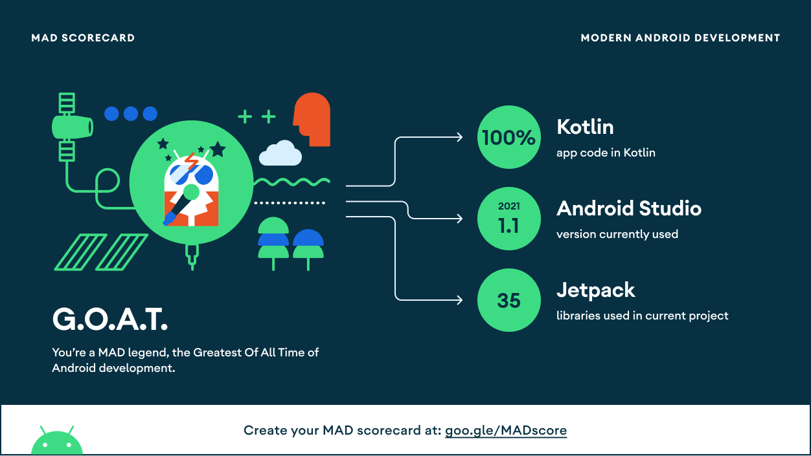

## Summary
"Now in Mobile" is an Android model codebase that demonstrates modern architecture with latest best practices. It takes ["currency converter"](https://exchangeratesapi.io/) as the use case.   

## Tech Stack
#### Foundation
- [Coroutines](https://developer.android.com/kotlin/coroutines) - Performing asynchronous code with sequential manner.
- [Dagger Hilt](https://developer.android.com/training/dependency-injection/hilt-android) - The opinionated DI framework for Android development.
- [DataStore](https://developer.android.com/topic/libraries/architecture/datastore) - Preferences in nutshell with coroutines support.
- [Flow](https://developer.android.com/kotlin/flow) - Reactive streams based on coroutines, just like Rx or LiveData. But simpler.
- [Lifecycle](https://developer.android.com/topic/libraries/architecture/coroutines) - Android's component lifecycle with coroutines support.
- [Room](https://developer.android.com/training/data-storage/room) - Android ORM for SQLite database. Also, try out its integration with [Database Inspector](https://developer.android.com/studio/inspect/database).
- [View Binding](https://developer.android.com/topic/libraries/view-binding) - Providing safe access to view.
- [ViewModel](https://developer.android.com/topic/libraries/architecture/viewmodel) - Presenter with its semi data persistence behavior.

#### UI
- [ConstraintLayout](https://developer.android.com/reference/androidx/constraintlayout/widget/ConstraintLayout) - Manage layout positioning & alignment with ease.
- [Material Components](https://github.com/material-components/material-components-android) - Material design toolkit.

#### Remote
- [OkHttp](https://square.github.io/okhttp/) - Http client for network request.
- [Retrofit](https://square.github.io/retrofit/) - API adapter wrapped over OkHttp.

#### Testing
- [Espresso](https://developer.android.com/training/testing/espresso) - Android UI tests.
- [Hilt Testing](https://developer.android.com/training/dependency-injection/hilt-testing) - For swapping production dependencies with test doubles in ease.

#### Health
* [LeakCanary](https://square.github.io/leakcanary) (Debug) - Memory leak detector.
* [StrictMode](https://developer.android.com/reference/android/os/StrictMode) (Debug) - Tool for checking if any *should-be-background* operation is done on main thread.
   

## MAD Scorecard

 
 

## Architecture
The codebase adopts [Clean Architecture](https://blog.cleancoder.com/uncle-bob/2012/08/13/the-clean-architecture.html) with [Unidirectional Data Flow (UDF)](https://en.wikipedia.org/wiki/Unidirectional_Data_Flow_(computer_science)) for presentation layer. You can read more in detail [here](https://bukuwarung.atlassian.net/wiki/spaces/tech/pages/1021151501/App+Architecture).

  

To nurture scalable, resilient, and testable nature, the codebase utilizes following in-house core components:
- **Neuro**: Deeplink & in-app screen navigator.
- **Pin**: Abstract [SharedPreferences](https://developer.android.com/reference/android/content/SharedPreferences.html) functionality.
- **Matrix**: Abstract remote config service.
- **Telemetry**: Abstract analytics record service.
- **Tracker**: Abstract event tracker for analytics service.
- **Remote**: Handles all about remote things.
- **Database**: Handles all about local database things.
- **Udf**: Framework to manage presentation layer.
- **Lector**: Provides linguistic and text translation service.
- **Messenger**: Snackbar/Toast message displayer.
 
 

## Testing Principles
Black-box/behavior-driven testing with `Activity/Fragment` as the sole SUT. Please refer [here](https://bukuwarung.atlassian.net/wiki/spaces/tech/pages/1030685127/Testing) for more details.
